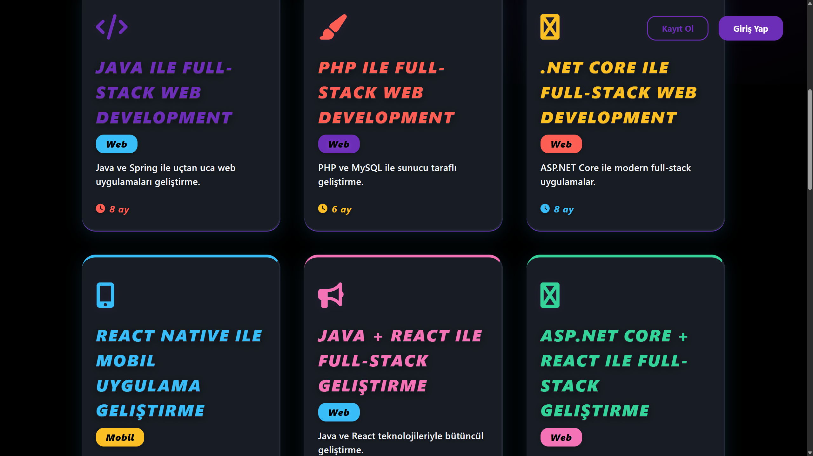
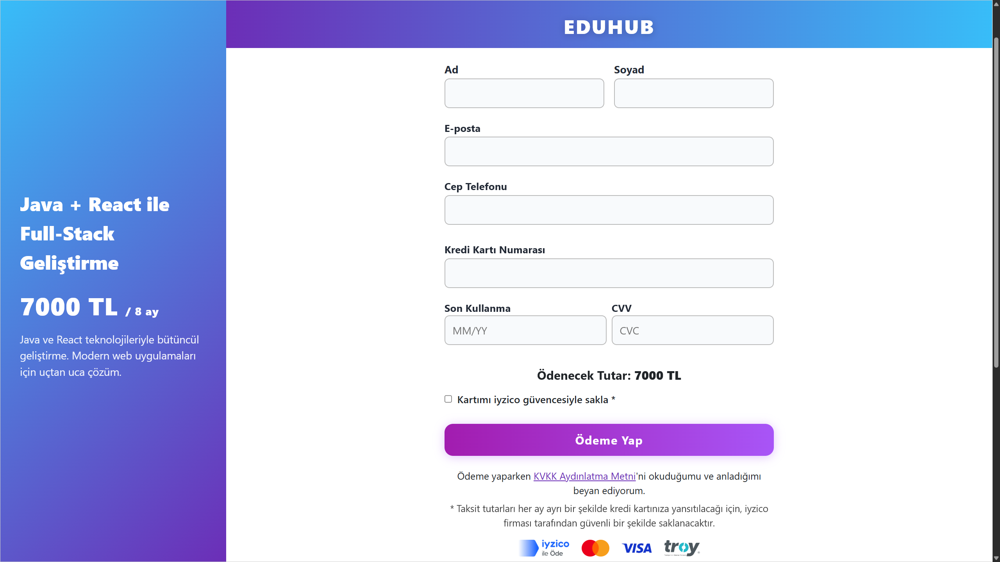
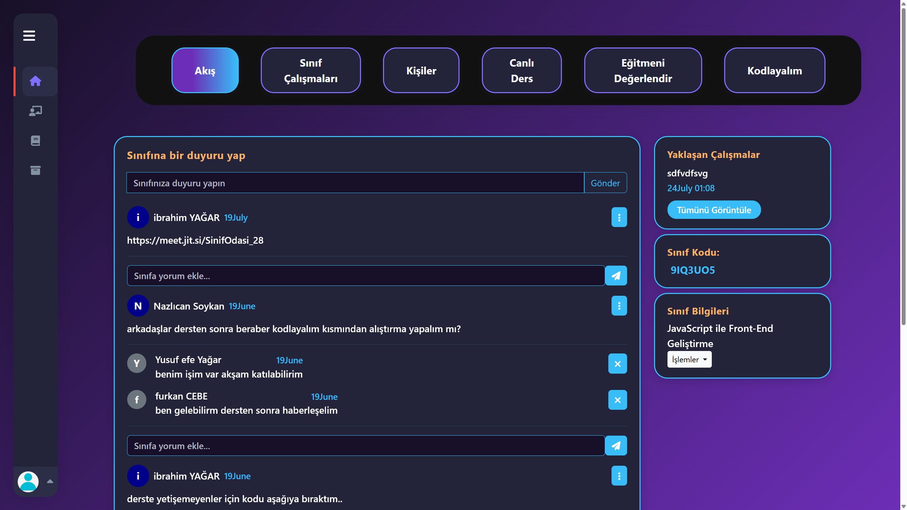
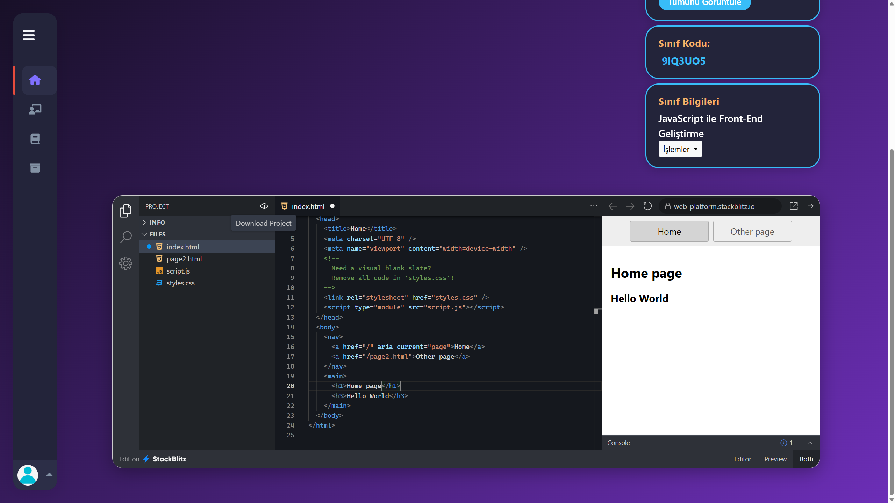

# 📚 EduHub - Sınıf Yönetim Sistemi

[](https://dotnet.microsoft.com/)
[](https://dotnet.microsoft.com/apps/aspnet)
[](https://www.microsoft.com/sql-server)
[](LICENSE)

EduHub, YouTube benzeri, eğitmen ve öğrencileri aynı platformda buluşturan kapsamlı bir online eğitim ve canlı ders deneyimi platformudur. Platform, eğitmenlerin içeriklerini ücretli veya ücretsiz yayınlamasını, öğrencilerin yorum ve puanlara göre eğitmen seçmesini ve kullanıcıların eş zamanlı olarak hem öğrenci hem eğitmen rolü üstlenmesini sağlar.

## 📸 Ekran Görüntüleri

> **Not**: Proje görselleri `docs/screenshots/` klasöründe yer almaktadır. Ekran görüntülerinizi bu klasöre ekleyebilirsiniz.  
> **Rehber**: Görsel ekleme talimatları için [docs/SCREENSHOTS_GUIDE.md](docs/SCREENSHOTS_GUIDE.md) dosyasına bakın.

### Ana Özellikler

<div align="center">

#### 🏠 Ana Sayfa ve Kurs Kataloğu



#### 📚 Kurs Detay Sayfası


#### 💳 Ödeme Formu


#### 📊 Kullanıcı Dashboard


#### 👥 Sınıf Detay Sayfası


#### 🎥 Canlı Ders (Jitsi Meet)


#### 💻 Online Kod Editörü (StackBlitz)


</div>

## 📋 İçindekiler

- [Özellikler](#-özellikler)
- [Teknoloji Stack](#-teknoloji-stack)
- [Gereksinimler](#-gereksinimler)
- [Kurulum](#-kurulum)
- [Kullanım](#-kullanım)
- [Proje Yapısı](#-proje-yapısı)
- [Veritabanı Modelleri](#-veritabanı-modelleri)
- [API Dokümantasyonu](#-api-dokümantasyonu)
- [Güvenlik](#-güvenlik)
- [Test](#-test)
- [Dağıtım](#-dağıtım)
- [Katkıda Bulunma](#-katkıda-bulunma)
- [Lisans](#-lisans)

## 🚀 Özellikler

### Temel Özellikler
- ✅ **Kullanıcı Yönetimi**: ASP.NET Core Identity ile güvenli kimlik doğrulama ve yetkilendirme
- ✅ **Sınıf Yönetimi**: Öğretmenler sınıf oluşturabilir, öğrenciler benzersiz kod ile katılabilir
- ✅ **Ödev Sistemi**: Ödev oluşturma, dosya yükleme, puanlama ve teslim takibi
- ✅ **Duyuru Sistemi**: Sınıf içi duyuru paylaşımı ve yorum sistemi
- ✅ **Öğretmen Değerlendirme**: Öğrenciler öğretmenleri değerlendirebilir ve yorum yapabilir
- ✅ **Dosya Yönetimi**: Ödev dosyaları için güvenli yükleme ve saklama
- ✅ **Arşivleme**: Sınıfları arşivleme ve geri getirme özelliği
- ✅ **Rol Yönetimi**: Öğretmen ve öğrenci rolleri ile yetkilendirme
- ✅ **Esnek Fiyatlandırma**: Eğitimler ücretsiz başlayıp geri bildirimlere göre ücretliye dönebilir.
- ✅ **Proje İndirme: Öğrenciler çalışmalarını VSCode gibi editörlerde açılacak biçimde indirebilir.


### İleri Seviye Özellikler
- 🎥 **Canlı Ders Desteği**: Jitsi Meet entegrasyonu ile gerçek zamanlı video konferans
- 💻 **Online Kod Editörü**: StackBlitz entegrasyonu ile tarayıcıda kod yazma ve çalıştırma
- 💳 **Ödeme Sistemi**: iyzico entegrasyonu ile güvenli kurs satın alma
- 📚 **Kurs Kataloğu**: Açık katılımlı kurs listesi ve detay sayfaları
- ⭐ **Eğitmen Puanlama**: Şeffaf değerlendirme sistemi ile eğitmen kalitesi
- 🔐 Email doğrulama ile hesap aktivasyonu
- 📧 Şifre sıfırlama ve unutulan şifre yönetimi
- 🔒 Yetkilendirme kontrolleri ile güvenli erişim
- 📱 Responsive tasarım ile mobil uyumluluk
- 🎨 Bootstrap 5 ile modern UI/UX

## 🛠 Teknoloji Stack

### Backend
- **.NET 8.0**: Ana framework
- **ASP.NET Core MVC**: Web framework
- **Entity Framework Core 8.0.7**: ORM
- **SQL Server**: Veritabanı
- **ASP.NET Core Identity**: Kimlik doğrulama ve yetkilendirme

### Frontend
- **Razor Pages**: Server-side rendering
- **Bootstrap 5**: CSS framework
- **jQuery**: JavaScript kütüphanesi
- **jQuery Validation**: Form validasyonu

### Entegrasyonlar
- **Jitsi Meet**: Canlı video konferans ve ders desteği
- **StackBlitz**: Online kod editörü ve IDE
- **iyzico**: Ödeme ve e-ticaret altyapısı

### Development Tools
- **Entity Framework Tools**: Migration yönetimi
- **Visual Studio Code / Visual Studio 2022**: IDE

## 📋 Gereksinimler

### Sistem Gereksinimleri
- **.NET 8.0 SDK** veya üzeri
- **SQL Server 2019** veya üzeri (veya LocalDB)
- **Windows / Linux / macOS** işletim sistemi
- **Git** (versiyon kontrolü için)

### Geliştirme Ortamı
- Visual Studio 2022 (önerilen) veya
- Visual Studio Code + C# extension
- SQL Server Management Studio (SSMS) - opsiyonel

## 🔧 Kurulum

### 1. Projeyi Klonlama

```bash
git clone https://github.com/ibrahimyagar/EduHub.git
cd EduHub/Classroom
```

### 2. Bağımlılıkları Yükleme

```bash
dotnet restore
```

### 3. Veritabanı Yapılandırması

`appsettings.json` dosyasını oluşturun veya `appsettings.Example.json` dosyasını kopyalayın:

```bash
cp appsettings.Example.json appsettings.json
```

`appsettings.json` dosyasında connection string'i yapılandırın:

```json
{
  "ConnectionStrings": {
    "DefaultConnection": "Server=(localdb)\\mssqllocaldb;Database=EduHubDb;Trusted_Connection=True;MultipleActiveResultSets=true"
  }
}
```

**Not**: Production ortamında connection string'i environment variable olarak saklayın.

### 4. Veritabanı Migration

```bash
dotnet ef database update
```

### 5. Uygulamayı Çalıştırma

```bash
dotnet run
```

Veya Visual Studio'da `F5` tuşuna basın.

Uygulama varsayılan olarak şu adreste çalışacaktır:
- HTTP: `http://localhost:5057`
- HTTPS: `https://localhost:7242`

### 6. İlk Kullanıcı Oluşturma

1. Tarayıcıda uygulamayı açın
2. "Register" linkine tıklayın
3. Email adresinizi girin (email doğrulama gereklidir)
4. Email'inizdeki doğrulama linkine tıklayın
5. Şifrenizi belirleyin ve giriş yapın

## 💻 Kullanım

### Öğretmen İşlemleri

1. **Sınıf Oluşturma**
   - Ana sayfada "Sınıf Oluştur" butonuna tıklayın
   - Sınıf adı ve açıklama girin
   - Sistem otomatik olarak benzersiz bir kod oluşturur
   - Öğrenciler bu kod ile sınıfa katılabilir

2. **Ödev Oluşturma**
   - Sınıf sayfasında "Ödev Oluştur" butonuna tıklayın
   - Ödev başlığı, açıklama ve teslim tarihi girin
   - Ödev otomatik olarak sınıftaki tüm öğrencilere atanır

3. **Ödev Değerlendirme**
   - Ödev listesinde öğrenci gönderimlerini görüntüleyin
   - Dosyaları indirin ve değerlendirin
   - Puan verin (0-100 arası)

4. **Duyuru Paylaşma**
   - Sınıf sayfasında duyuru kutusuna mesaj yazın
   - "Paylaş" butonuna tıklayın

### Öğrenci İşlemleri

1. **Sınıfa Katılma**
   - Ana sayfada "Sınıfa Katıl" butonuna tıklayın
   - Öğretmenden aldığınız benzersiz kodu girin
   - Sınıf ana sayfanızda görünecektir

2. **Ödev Teslim Etme**
   - Ödev sayfasında "Ödev Ekle" butonuna tıklayın
   - Metin yazabilir veya dosya yükleyebilirsiniz
   - "Gönder" butonuna tıklayın

3. **Öğretmen Değerlendirme**
   - Sınıf sayfasında öğretmeni değerlendirin
   - 1-5 arası puan verin ve yorum yazın

## 📁 Proje Yapısı

```
Classroom/
├── Areas/
│   └── Identity/                    # ASP.NET Core Identity sayfaları
│       └── Pages/
│           └── Account/            # Login, Register, Password Reset vb.
├── Controllers/                     # MVC Controller'ları
│   ├── ClassroomController.cs      # Sınıf yönetimi işlemleri
│   ├── CommentController.cs        # Yorum işlemleri
│   ├── HelloController.cs           # Landing page ve kurs gösterimi
│   ├── HomeController.cs            # Ana sayfa ve sınıf listesi
│   └── HomeworkController.cs       # Ödev yönetimi
├── Data/
│   ├── ApplicationDbContext.cs     # Entity Framework DbContext
│   └── Migrations/                  # Veritabanı migration dosyaları
├── Models/                          # Veri modelleri
│   ├── Announcements.cs            # Duyuru modeli
│   ├── ApplicationUser.cs          # Kullanıcı modeli (Identity genişletilmiş)
│   ├── ClassRoom.cs                # Sınıf modeli
│   ├── Class_User.cs               # Sınıf-Kullanıcı ilişki modeli
│   ├── Comment.cs                  # Yorum modeli
│   ├── Homework.cs                 # Ödev modeli
│   ├── Homework_User.cs            # Ödev-Kullanıcı ilişki modeli
│   └── TeacherRating.cs            # Öğretmen değerlendirme modeli
├── Views/                           # Razor view dosyaları
│   ├── Classroom/                  # Sınıf görünümleri
│   ├── Homework/                   # Ödev görünümleri
│   ├── Home/                       # Ana sayfa görünümleri
│   └── Shared/                     # Paylaşılan layout ve partial view'lar
├── ViewModels/                      # View modelleri
│   └── JoinClassRoomModel.cs       # Sınıfa katılma view modeli
├── wwwroot/                         # Statik dosyalar
│   ├── css/                        # CSS dosyaları
│   ├── js/                         # JavaScript dosyaları
│   ├── images/                     # Görsel dosyalar
│   ├── lib/                        # Kütüphaneler (Bootstrap, jQuery)
│   └── uploads/                    # Yüklenen dosyalar (git'te değil)
├── Properties/
│   └── launchSettings.json         # Uygulama başlatma ayarları
├── Program.cs                       # Uygulama giriş noktası
├── appsettings.json                 # Yapılandırma dosyası (git'te değil)
└── appsettings.Example.json         # Örnek yapılandırma dosyası
```

## 🗄️ Veritabanı Modelleri

### İlişki Diyagramı

```
ApplicationUser (Identity)
├── 1:N ClassRoom (oluşturulan sınıflar)
├── 1:N Class_User (üye olduğu sınıflar)
├── 1:N Homework (oluşturulan ödevler)
├── 1:N Announcements (oluşturulan duyurular)
├── 1:N Homework_User (teslim edilen ödevler)
└── 1:N Comment (yazılan yorumlar)

ClassRoom
├── N:1 ApplicationUser (oluşturan öğretmen)
├── 1:N Class_User (sınıf üyeleri)
├── 1:N Homework (sınıf ödevleri)
└── 1:N Announcements (sınıf duyuruları)

Homework
├── N:1 ClassRoom (ait olduğu sınıf)
├── N:1 ApplicationUser (oluşturan öğretmen)
└── 1:N Homework_User (öğrenci gönderimleri)

Announcements
├── N:1 ClassRoom (ait olduğu sınıf)
├── N:1 ApplicationUser (oluşturan kullanıcı)
└── 1:N Comment (yorumlar)

TeacherRating
├── N:1 ApplicationUser (öğretmen)
└── N:1 ApplicationUser (öğrenci)
```

### Tablo Detayları

#### ClassRoom
- `Id` (int, PK): Sınıf ID
- `Name` (string): Sınıf adı
- `Description` (string): Sınıf açıklaması
- `UnicCode` (string): Benzersiz katılım kodu
- `Color` (string): Sınıf rengi (hex)
- `ApplicationUserId` (string, FK): Oluşturan öğretmen ID
- `IsActive` (bool): Aktif mi?
- `IsDelete` (bool): Silindi mi? (soft delete)

#### Homework
- `Id` (int, PK): Ödev ID
- `Name` (string): Ödev adı
- `Description` (string): Ödev açıklaması
- `CreatedAt` (DateTime): Oluşturulma tarihi
- `DueDate` (DateTime): Teslim tarihi
- `ApplicationUserId` (string, FK): Oluşturan öğretmen ID
- `ClassRoomId` (int, FK): Sınıf ID
- `IsDelete` (bool): Silindi mi?

#### Homework_User
- `Id` (int, PK): Kayıt ID
- `ApplicationUserId` (string, FK): Öğrenci ID
- `HomeworkId` (int, FK): Ödev ID
- `Work` (string): Teslim edilen çalışma (metin veya dosya yolu)
- `Point` (int): Alınan puan (-1 = henüz değerlendirilmedi)
- `CreatedAt` (DateTime): Teslim tarihi

#### Announcements
- `Id` (int, PK): Duyuru ID
- `Contents` (string): Duyuru içeriği
- `CreatedAt` (DateTime): Oluşturulma tarihi
- `ApplicationUserId` (string, FK): Oluşturan kullanıcı ID
- `ClassRoomId` (int, FK): Sınıf ID
- `IsDelete` (bool): Silindi mi?

#### Comment
- `Id` (int, PK): Yorum ID
- `Description` (string): Yorum içeriği
- `ApplicationUserId` (string, FK): Yorum yapan kullanıcı ID
- `AnnouncementsId` (int, FK): Duyuru ID
- `CreatedAt` (DateTime): Oluşturulma tarihi
- `IsDelete` (bool): Silindi mi?

#### TeacherRating
- `Id` (int, PK): Değerlendirme ID
- `ClassroomId` (int): Sınıf ID
- `TeacherId` (string, FK): Öğretmen ID
- `StudentId` (string, FK): Öğrenci ID
- `Rating` (int): Puan (1-5)
- `Comment` (string): Yorum
- `CreatedAt` (DateTime): Oluşturulma tarihi

#### Class_User
- `Id` (int, PK): Kayıt ID
- `ApplicationUserId` (string, FK): Kullanıcı ID
- `ClassRoomId` (int, FK): Sınıf ID
- `Roles` (bool): true = öğretmen, false = öğrenci
- `IsDelete` (bool): Silindi mi?

## 📡 API Dokümantasyonu

Bu proje MVC pattern kullanır, ancak API endpoint'leri de mevcuttur. Detaylı API dokümantasyonu için [API.md](docs/API.md) dosyasına bakın.

### Örnek Endpoint'ler

**Sınıf Oluşturma (POST)**
```
POST /Home/CreateClassRoom
Body: { Name: string, Description: string }
```

**Sınıfa Katılma (POST)**
```
POST /Home/JoinClassRoom
Body: { ClassRoomUnicCode: string }
```

**Duyuru Ekleme (POST)**
```
POST /Classroom/Announcements
Parameters: announcements: string, classroomId: int
```

**Ödev Oluşturma (POST)**
```
POST /Homework/CreateHomework
Parameters: questionTitle: string, description: string, dueDateTime: DateTime, classroomId: int
```

**Ödev Teslim Etme (POST)**
```
POST /Homework/AddHomework
Parameters: HomeworkId: int, ClassroomId: int, HwText: string, HomeworkFile: IFormFile
```

## 🔐 Güvenlik

### Güvenlik Özellikleri

- ✅ **ASP.NET Core Identity**: Güvenli kimlik doğrulama
- ✅ **Email Doğrulama**: Hesap aktivasyonu için email doğrulama
- ✅ **Şifre Hashleme**: Şifreler güvenli şekilde hashlenir
- ✅ **CSRF Koruması**: Anti-forgery token'ları
- ✅ **XSS Koruması**: Razor engine otomatik encoding
- ✅ **SQL Injection Koruması**: Entity Framework parametreli sorgular
- ✅ **Yetkilendirme**: `[Authorize]` attribute ile rol bazlı erişim kontrolü

### Güvenlik Önerileri

1. **Production Ortamı**
   - `appsettings.Production.json` kullanın
   - Connection string'i environment variable olarak saklayın
   - HTTPS zorunlu tutun
   - Güçlü şifre politikaları belirleyin

2. **Secrets Yönetimi**
   - User Secrets kullanın (development)
   - Azure Key Vault kullanın (production)

3. **Dosya Yükleme**
   - Dosya tipi kontrolü yapın
   - Dosya boyutu limiti koyun
   - Virus taraması ekleyin (production)

Detaylı güvenlik bilgileri için [SECURITY.md](SECURITY.md) dosyasına bakın.

## 🧪 Test

### Test Çalıştırma

```bash
# Tüm testleri çalıştır
dotnet test

# Belirli bir test projesi için
dotnet test Classroom.Tests
```

### Test Kapsamı

- ✅ Birim testleri (Unit Tests)
- ✅ Entegrasyon testleri (Integration Tests)
- ⚠️ E2E testleri (planlanıyor)

Test örnekleri için `Classroom.Tests` klasörüne bakın.

## 🚀 Dağıtım

### Docker ile Çalıştırma

```bash
# Docker image oluştur
docker build -t eduhub .

# Container çalıştır
docker run -p 8080:80 eduhub
```

### Docker Compose ile Çalıştırma

```bash
docker-compose up -d
```

Detaylı dağıtım bilgileri için [DEPLOYMENT.md](docs/DEPLOYMENT.md) dosyasına bakın.

### Production Deployment

1. **Azure App Service**
   ```bash
   az webapp create --resource-group myResourceGroup --plan myAppServicePlan --name myAppName --runtime "DOTNET|8.0"
   ```

2. **IIS**
   - `dotnet publish` komutu ile publish edin
   - IIS'te application pool oluşturun
   - Published klasörü site root olarak ayarlayın

3. **Linux (Nginx)**
   - Kestrel reverse proxy olarak çalışır
   - Nginx konfigürasyonu için örnek dosyalara bakın

## 🤝 Katkıda Bulunma

Katkılarınızı bekliyoruz! Lütfen [CONTRIBUTING.md](CONTRIBUTING.md) dosyasını okuyun.

1. Fork edin
2. Feature branch oluşturun (`git checkout -b feature/AmazingFeature`)
3. Değişikliklerinizi commit edin (`git commit -m 'Add some AmazingFeature'`)
4. Branch'inizi push edin (`git push origin feature/AmazingFeature`)
5. Pull Request açın

## 📄 Tez Dokümantasyonu

Bu proje, Bandırma Onyedi Eylül Üniversitesi Bilgisayar Mühendisliği Bölümü Lisans Bitirme Projesi kapsamında geliştirilmiştir.

**Tez Dokümanı**: [docs/THESIS.md](docs/THESIS.md)  
**Tez Başlığı**: Canlı Ders Destekli ve Online Kod Editörü Gömülü Eğitim Platformu  
**Danışman**: Doç. Dr. Mehmet Akif Çifçi  
**Tarih**: 19/06/2025

## 📝 Lisans

Bu proje [MIT Lisansı](LICENSE) altında lisanslanmıştır.

## 👥 Geliştiriciler

- **İbrahim Yağar** - Proje sahibi ve geliştirici

## 📞 İletişim

Sorularınız için issue açabilir veya [GitHub Discussions](https://github.com/ibrahimyagar/EduHub/discussions) kullanabilirsiniz.

## 🙏 Teşekkürler

- ASP.NET Core ekibine
- Bootstrap ve jQuery topluluklarına
- Tüm katkıda bulunanlara

---

⭐ Bu projeyi beğendiyseniz yıldız vermeyi unutmayın!
